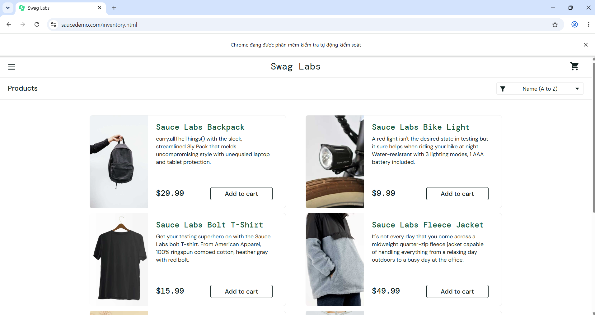
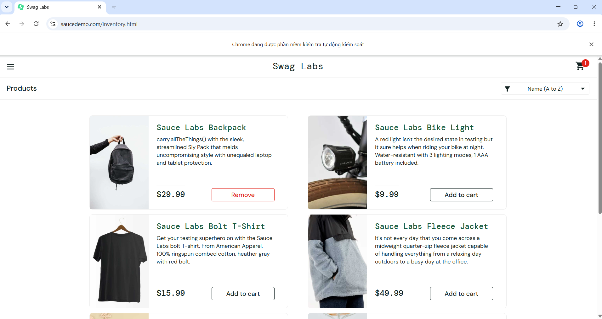
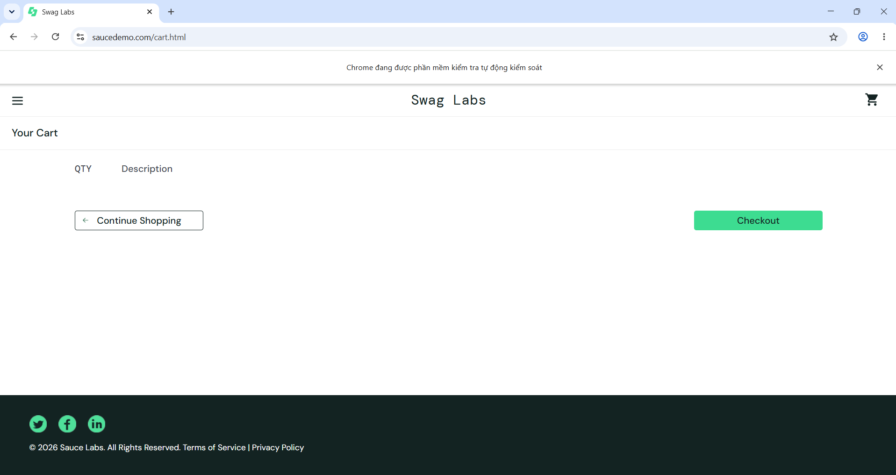

# Selenium Automation Testing Project

## 📌 1. Giới thiệu
Dự án này sử dụng Selenium WebDriver với Python để thực hiện kiểm thử tự động (Automation Testing) trên website:

👉 https://www.saucedemo.com/

Mục tiêu của dự án:
- Kiểm thử chức năng đăng nhập (Login)
- Kiểm thử thêm sản phẩm vào giỏ hàng (Add to Cart)
- Kiểm thử xem giỏ hàng (View Cart)

---

## 🛠️ 2. Công nghệ sử dụng
- Python 3.11
- Selenium WebDriver
- Google Chrome
- Selenium Manager (tự động quản lý ChromeDriver)

---

## 🌐 3. Website kiểm thử

Website:
https://www.saucedemo.com/

Tài khoản test:

Username: standard_user  
Password: secret_sauce  

---

## 🧪 4. Test Cases

### ✔ Test Case 1: Login
- Mở trang web
- Nhập username và password
- Click Login
- Kiểm tra chuyển sang trang sản phẩm

File: `test_login.py`



---

### ✔ Test Case 2: Add to Cart
- Đăng nhập hệ thống
- Thêm sản phẩm vào giỏ hàng
- Kiểm tra số lượng trong giỏ hàng

File: `test_add_cart.py`



---

### ✔ Test Case 3: View Cart
- Đăng nhập hệ thống
- Nhấn vào biểu tượng giỏ hàng
- Kiểm tra trang cart hiển thị

File: `test_view_cart.py`



---

## ▶️ 5. Hướng dẫn cài đặt và chạy

### Bước 1: Cài đặt thư viện Selenium
```bash
pip install selenium
